# bkit — Full Reference

> The only Claude Code plugin that verifies AI-generated code against its own design specs.

> **Quick start lives in [README.md](README.md).** This file is the deep reference: full command surface, autonomous workflow internals, quality gates, Sprint Management, and architecture. **Release history is maintained in [CHANGELOG.md](CHANGELOG.md) — not duplicated here.**

[](https://opensource.org/licenses/Apache-2.0)
[](https://code.claude.com)
[](CHANGELOG.md)
[](https://popupstudio.ai)

---

## Table of Contents

1. [Design Philosophy](#1-design-philosophy)
2. [Command Cheat Sheet](#2-command-cheat-sheet)
3. [The Autonomous Workflow](#3-the-autonomous-workflow)
4. [Quality Gates & Self-Repair](#4-quality-gates--self-repair)
5. [Trust Level & Control](#5-trust-level--control)
6. [Sprint Management](#6-sprint-management)
7. [CTO-Led & PM Agent Teams](#7-cto-led--pm-agent-teams)
8. [Architecture](#8-architecture)
9. [Skill Evals](#9-skill-evals)
10. [Installation & Customization](#10-installation--customization)
11. [Requirements](#11-requirements)
12. [Language Support](#12-language-support)
13. [License & Contributing](#13-license--contributing)

---

## 1. Design Philosophy

bkit is not a productivity hack. It brings **engineering discipline** to AI-native development.

The software industry refined how *humans* write code over decades — version control, code review, CI/CD, testing pyramids. When AI enters the loop, most of that discipline evaporates: developers prompt, accept, ship. Documentation becomes an afterthought. Quality becomes luck.

**bkit exists because AI-assisted development deserves the same rigor as traditional engineering.**

| We optimize for | Over | Concretely |
|---|---|---|
| **Process** | Output | One feature through proper planning + design + implementation + verification beats ten hacked-together features. The PDCA cycle *is* the product. |
| **Verification** | Trust | AI generates plausible code. Plausible is not correct. Every implementation goes through gap analysis. Below 90% match? The system iterates. We do not ship hope. |
| **Context** | Prompts | A clever prompt helps once. A systematic context system helps every time. 44 skills + 34 agents + 163 lib modules exist so the AI receives the right context at the right moment. |
| **Constraints** | Features | Three project levels, not infinite configuration. A fixed 9-stage pipeline, not a customizable workflow builder. Opinionated defaults eliminate decision fatigue. |

> *"We do not offer a hundred features. We engineer each one through proper design and verification. That is the difference between a tool and a discipline."*

---

## 2. Command Cheat Sheet

| Command | What it does | Spawned agents |
|---|---|---|
| `/pdca pm <feat>` | 4 PM agents in parallel → PRD with 43 frameworks | pm-lead · pm-discovery · pm-strategy · pm-research · pm-prd |
| `/pdca plan <feat>` | Plan doc with Context Anchor + Module Map | product-manager |
| `/pdca design <feat>` | 3 architecture options (Minimal / Clean / Pragmatic) | cto-lead · frontend-architect · security-architect |
| `/pdca do <feat>` | Implementation (single-agent mode) | bkend-expert · frontend-architect |
| `/pdca team <feat>` | **4–6 specialist agents in parallel** (recommended) | cto-lead orchestrates: developer · qa · frontend · security · architect |
| `/pdca check <feat>` | Design ↔ code gap analysis | gap-detector |
| `/pdca iterate <feat>` | Auto-fix sub-90% match (Evaluator-Optimizer, max 5) | pdca-iterator |
| `/pdca qa <feat>` | L1–L5 test execution | qa-lead · qa-test-planner · qa-test-generator · qa-debug-analyst · qa-monitor |
| `/pdca report <feat>` | KPI + lessons learned report | report-generator |
| `/pdca archive <feat>` | Move feature docs to archive + state cleanup | — |
| `/pdca status` | Current PDCA state across all features | — |
| `/pdca cleanup` | Remove stale features (idle > 7d) | — |
| `/sprint init <id> --features a,b,c --trust L<0-4>` | Group features into a Sprint meta-container | sprint-master-planner |
| `/sprint start <id>` | Auto-run sprint phases up to Trust Level scope | sprint-orchestrator |
| `/sprint qa <id>` | 7-Layer S1 dataFlow integrity check | sprint-qa-flow |
| `/sprint report <id>` | Sprint completion report with KPIs | sprint-report-writer |
| `/sprint archive <id>` | Sprint terminal state (forward-only) | — |
| `/control level 0..4` | Set autonomy: Manual / Guided / Semi-Auto / Auto / Full-Auto | — |
| `/control status` | Show current Trust Level + Trust Score (0–100) | — |
| `/bkit` | List all skills, agents, commands | — |
| `/bkit-explore` | Browse component tree (5 categories) | — |
| `/pdca watch` | Live dashboard ticking every 30s | — |

**Sprint Management has 16 sub-actions total**: `init · start · status · list · watch · phase · iterate · qa · report · archive · pause · resume · fork · feature · help · master-plan`.

---

## 3. The Autonomous Workflow

bkit integrates **five layers** — Sprint Management as the outer container, PDCA as the per-feature inner loop, Trust Level as the single autonomy knob for both, Quality Gates enforcing thresholds, and Auto-Iterate healing gaps.

### 3.1 Five-Layer Integration

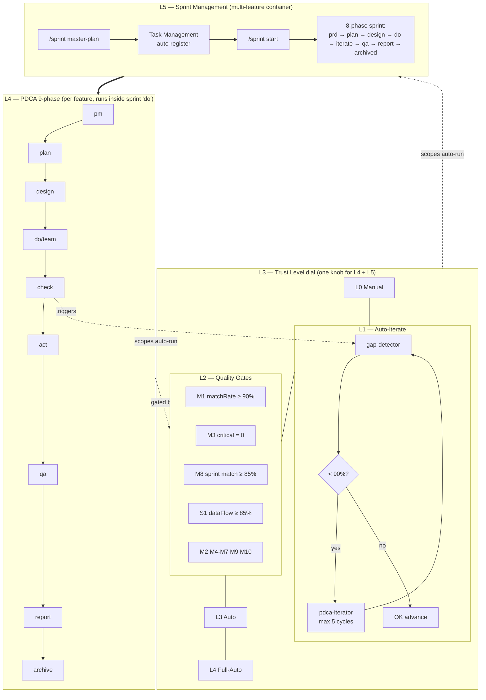

| Layer | Surface | What runs unattended |
|---|---|---|
| **L5 Sprint Management** | `/sprint master-plan` · `/sprint start` · `/sprint status` · `/sprint qa` · `/sprint report` · `/sprint archive` | Multi-feature release split into context-budgeted sprints (Kahn topological + greedy bin-packing), each sprint auto-registered in Task Management, then 8-phase auto-run scoped by Trust Level. 4 auto-pause triggers (QUALITY_GATE_FAIL / ITERATION_EXHAUSTED / BUDGET_EXCEEDED / PHASE_TIMEOUT) provide the safety net. |
| **L4 PDCA 9-phase** | `/pdca pm` · `/pdca team` · `/pdca check` · `/pdca iterate` · `/pdca qa` · `/pdca report` | Per-feature loop. Inside a sprint, runs **once per feature** in the `do` phase. Standalone for single-feature work. |
| **L3 Trust Level** | `/control level 0..4` | Single dial. Scopes how far both L5 sprint phases and L4 PDCA phases auto-advance. L2 default; L4 = fire-and-forget. |
| **L2 Quality Gates** | `bkit.config.json` thresholds + audit log | M1–M10 + S1. Failed gate → phase pause + audit entry. |
| **L1 Auto-Iterate** | `pdca.autoIterate = true` (default) | `gap-detector` sub-90 → `pdca-iterator` automatic max-5 cycle Evaluator-Optimizer. |

### 3.2 Sprint User Journey — 4 Steps

The v2.1.13 Sprint Management user experience is a four-step flow. The user explicitly described these four steps as the core UX:

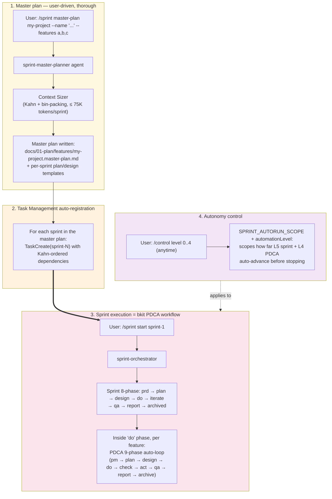

| Step | User command | bkit auto-action | Output |
|---|---|---|---|
| **1. Master plan** | `/sprint master-plan my-project --name "Q2 Launch" --features auth,payment,reports` | `sprint-master-planner` agent writes a Context-Anchor-driven master plan. Context Sizer splits features into sprints honoring the 75K-tokens/sprint budget and dependency graph (Kahn topological sort + greedy bin-packing). | `docs/01-plan/features/my-project.master-plan.md` + per-sprint `prd` / `plan` / `design` templates; `.bkit/state/master-plans/<projectId>.json`; audit log entry `master_plan_created`. |
| **2. Task registration** | _(automatic, happens during Step 1)_ | Every sprint in `plan.sprints[]` is registered in bkit's Task Management System with `TaskCreate` calls. Cross-sprint `dependsOn` edges become task-level `blockedBy` relationships. | One task per sprint, Kahn-ordered. Visible via `/sprint list` or `TaskList`. |
| **3. Sprint execution** | `/sprint start sprint-1` | `sprint-orchestrator` runs the 8-phase sprint lifecycle (`prd → plan → design → do → iterate → qa → report → archived`). Inside the `do` phase, **bkit's PDCA 9-phase runs once per feature** in the sprint — pm-lead writes the PRD, cto-lead spawns the team, gap-detector measures, pdca-iterator self-repairs. | `.bkit/state/sprints/sprint-1.json` updates per phase; per-feature PDCA artifacts (`docs/00-pm/...`, `docs/01-plan/features/...`, `docs/02-design/features/...`, etc.); sprint S1 dataFlow QA report on `qa` phase. |
| **4. Autonomy control** | `/control level 0..4` _(any time, before or during a sprint)_ | The dial scopes both L5 sprint and L4 PDCA phase auto-advancement. L2 default. L4 = fire-and-forget; auto-pauses only on one of the 4 sprint triggers or a quality gate fail. Trust Score also recommends a level based on track record. | `.bkit/state/trust-profile.json`; effective scope mirrored into `lib/control/automation-controller.js:SPRINT_AUTORUN_SCOPE` (L3 contract test SC-07 enforces 1:1 mirror). |

This is the canonical UX. Single-feature work skips Step 1 + 2 and runs directly into Step 3's PDCA loop. Step 4 applies to both.

### 3.3 What Each PDCA Phase Does (without you)

| Phase | bkit auto-action |
|---|---|
| `pm` | `pm-lead` orchestrates 4 PM agents in parallel: discovery (OST + Brainstorm + Assumption Risk) · strategy (JTBD + Lean Canvas + SWOT + PESTLE + Porter's + Growth Loops) · research (Personas + Competitors + TAM/SAM/SOM + Journey Map + ICP) · prd (synthesis with Pre-mortem + User/Job Stories + Test Scenarios + Stakeholder Map + Battlecards). Output: `docs/00-pm/<feature>.prd.md`. |
| `plan` | `product-manager` writes plan with **Context Anchor** (WHY/WHO/WHAT/RISK/SUCCESS/SCOPE) + Module Map + Session Guide. Output: `docs/01-plan/features/<feature>.plan.md`. |
| `design` | `cto-lead` proposes **3 architecture options** (Minimal / Clean / Pragmatic). One AskUserQuestion pause for the choice. Output: `docs/02-design/features/<feature>.design.md`. |
| `do` | Single agent (developer / bkend-expert / frontend-architect). |
| `do` *(team mode)* | `cto-lead` spawns 4–6 specialists in parallel: developer · qa · frontend · backend · security · architect (Enterprise level). Sequential dispatch enforced under ENH-292 to dodge caching regressions. |
| `check` | `gap-detector` measures design ↔ code match rate. |
| `act` | If matchRate ≥ 90% → advance. If < 90% → `pdca-iterator` Evaluator-Optimizer (max 5 cycles). |
| `qa` | `qa-lead` orchestrates 4 QA agents: test-planner (L1-L5 plan) · test-generator (test code) · debug-analyst (runtime errors) · qa-monitor (Zero Script QA via Docker logs). |
| `report` | `report-generator` produces completion report with KPIs + lessons learned + carry items. Output: `docs/04-report/features/<feature>.report.md`. |
| `archive` | Checkpoint preserved, state cleaned, memory `MEMORY.md` appended. |

### 3.3 Live Scenario (Trust L4, autoIterate=true)

```text
10:00  /pdca pm user-auth
       └─ pm-lead spawns 4 PM agents in parallel (43 frameworks)
10:08  PRD complete · M0 PASS · auto-advance
10:08  /pdca plan (auto)
       └─ product-manager → plan with Context Anchor
10:12  Plan complete · M1 (placeholder) PASS · auto-advance
10:12  /pdca design (auto)
       └─ cto-lead → 3 architecture options
10:18  Checkpoint AskUserQuestion: "Minimal / Clean / Pragmatic?"   [1 USER INPUT]
10:20  Design confirmed · M2 PASS · auto-advance
10:20  /pdca team (auto)
       └─ cto-lead → spawns frontend-architect + bkend-expert + qa-strategist + security-architect
10:45  Implementation complete · auto-advance to check
10:45  /pdca check (auto)
       └─ gap-detector → matchRate = 78%
10:45  M1 FAIL (78 < 90) → AUTO-TRIGGER /pdca iterate
10:48  Cycle 1: pdca-iterator analyzes → patches 7 gaps → re-measure 89%
10:50  Cycle 2: 3 more patches → re-measure 94% ✅ EXIT
10:50  /pdca qa (auto)
       └─ qa-lead → 4 QA agents L1-L5
10:58  QA PASS · auto-advance
10:58  /pdca report (auto)
       └─ report-generator → completion report
11:00  Feature complete.   Total: 60 min · 1 user input · 4–6 parallel agents · 2 self-repair cycles
```

---

## 4. Quality Gates & Self-Repair

### 4.1 The Gate Catalog

| Gate | Threshold | Triggered when | On fail |
|---|---|---|---|
| **M1** matchRate | ≥ 90% | check phase ends | `pdca-iterator` auto-fires (Evaluator-Optimizer, max 5 cycles) |
| **M2** codeQualityScore | ≥ 80 | post-do | `code-analyzer` re-runs, user confirmation requested |
| **M3** criticalIssue count | 0 | post-do | Immediate pause, user escalation |
| **M4** conventionCompliance | ≥ 90% | post-do | Lint auto-fix attempted |
| **M5** testCoverage | ≥ 70% | post-qa | `qa-test-generator` adds tests |
| **M6** securityScore | ≥ 85 | post-do | `security-architect` review |
| **M7** documentationCompleteness | ≥ 90% | post-report | Auto-doc generation |
| **M8** sprint matchRate | ≥ 85% | sprint iterate phase | Sprint iterate loops (max 5) |
| **M9** contractInvariant | 0 violation | CI gate | Build blocked |
| **M10** regressionGuard | 0 new regression | post-iterate | `regression-registry` registers + monitors |
| **S1** dataFlowIntegrity | ≥ 85% | sprint qa phase | 7-Layer hop re-verified (UI → Client → API → Validation → DB → Response → Client → UI) |

Thresholds live in `bkit.config.json`. Sprint-specific overrides via `sprint.config.{...}` at sprint init.

### 4.2 The Self-Repair Loop

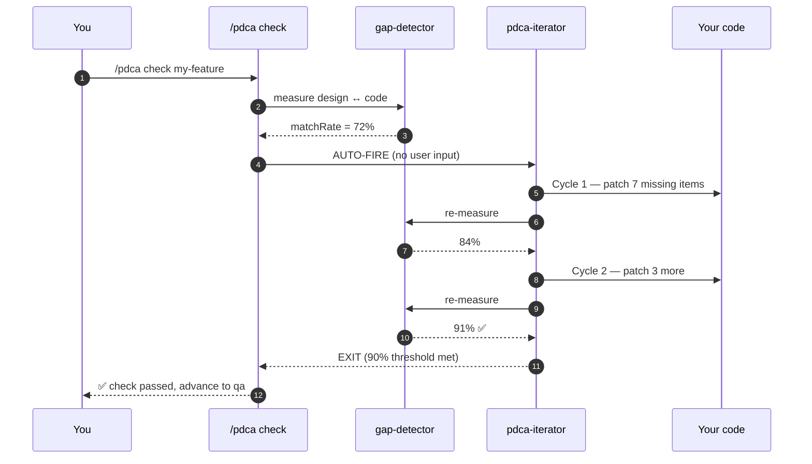

**Key**: iterate is *not* a button the user presses. `gap-detector` sub-90 detection → `pdca-iterator` fires automatically. If the 5th cycle still fails, `ITERATION_EXHAUSTED` triggers an auto-pause and escalates to the user.

---

## 5. Trust Level & Control

`/control level N` is the single autonomy dial. It scopes how far the orchestrator runs before stopping.

| Level | Name | stopAfter | When to pick |
|---|---|---|---|
| **L0** | Manual | every phase | First-time bkit user, want to inspect each output |
| **L1** | Guided | plan | Verifying scope before AI implements |
| **L2** | Semi-Auto | do | **Default** — Plan/Design/Do auto, QA/Report manual |
| **L3** | Auto | qa | Trust the implementation, double-check QA |
| **L4** | Full-Auto | archived | Fire-and-forget; pauses *only* on quality-gate failure |

### Trust Score (0–100)

bkit also computes a **Trust Score** from your recent track record (matchRate history, manual override frequency, gate-pass rate, etc.). A high Trust Score recommends auto-escalating Level; a low score auto-downgrades. Override anytime with `/control level N`.

| Trust Score | Auto-action |
|---|---|
| ≥ 80 | `pdca-fast-track` becomes available — auto-approves Checkpoints 1–8 |
| 60–79 | Defaults to L2 (Semi-Auto) |
| < 60 | Defaults to L1 (Guided) |

`autoEscalation` and `autoDowngrade` flags in `bkit.config.json:automation` toggle whether bkit can change Level on its own.

---

## 6. Sprint Management

A **Sprint** is a meta-container that groups one or more features under shared scope, budget, and timeline.

### 6.1 8-Phase Lifecycle

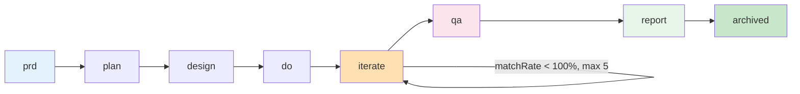

| Phase | Output | Agent |
|---|---|---|
| prd | `docs/00-pm/<sprint>.prd.md` | sprint-master-planner |
| plan | `docs/01-plan/features/<sprint>.plan.md` | sprint-master-planner |
| design | `docs/02-design/features/<sprint>.design.md` | sprint-master-planner |
| do | Feature-level PDCA cycles run inside | sprint-orchestrator |
| iterate | `docs/03-analysis/<sprint>.iterate.md` (per cycle) | pdca-iterator (delegated) |
| qa | `docs/05-qa/<sprint>.qa.md` (7-Layer S1) | sprint-qa-flow |
| report | `docs/04-report/features/<sprint>.report.md` | sprint-report-writer |
| archived | terminal state, state preserved | — |

### 6.2 4 Auto-Pause Triggers

A sprint pauses automatically on:

| Trigger | Condition | Most common cause |
|---|---|---|
| `QUALITY_GATE_FAIL` | Any M-gate or S1 fails | matchRate stuck below 90% after iterate exhaust |
| `ITERATION_EXHAUSTED` | iterate phase exceeds 5 cycles | Gap too large to auto-fix; needs human intervention |
| `BUDGET_EXCEEDED` | Token usage > sprint budget (default 1M) | Feature scope was underestimated |
| `PHASE_TIMEOUT` | Phase exceeds timeout (default 4h) | Hung or blocking |

Resume after fixing the root cause: `/sprint resume <id>`.

### 6.3 PDCA vs Sprint vs pdca-batch — Decision Tree

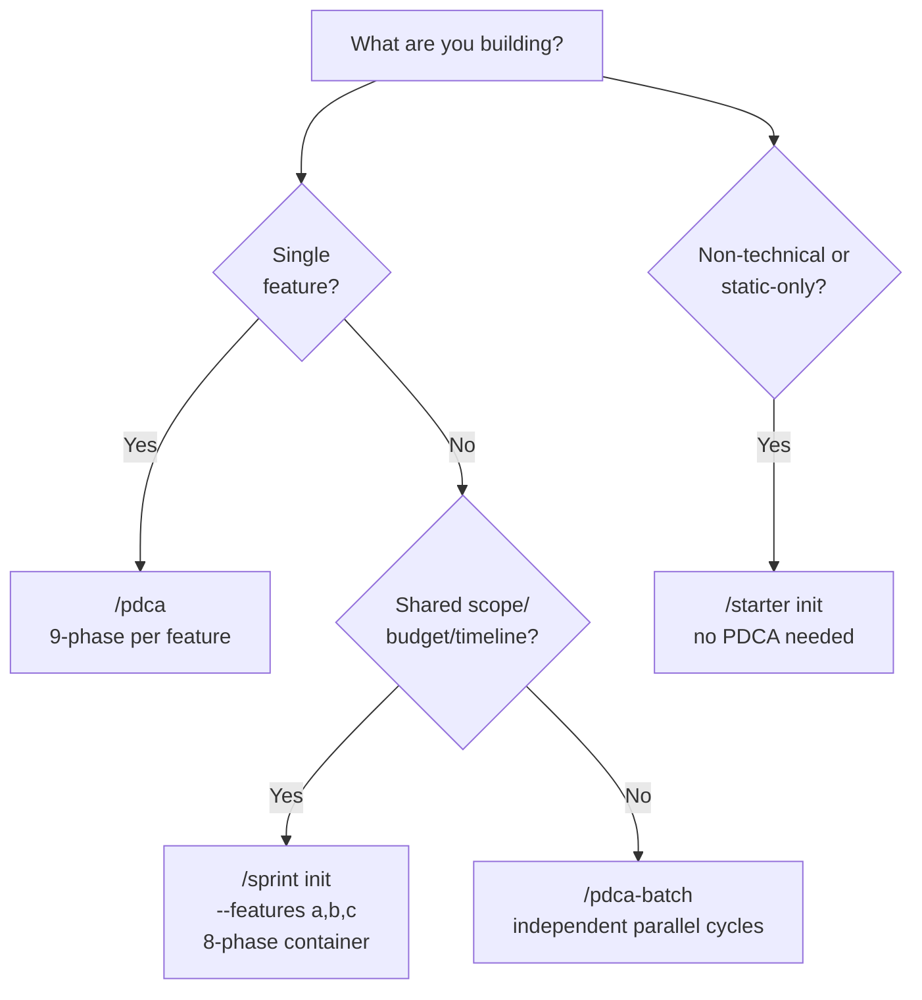

Korean deep-dive: [`docs/06-guide/sprint-management.guide.md`](docs/06-guide/sprint-management.guide.md). Migration mapping: [`docs/06-guide/sprint-migration.guide.md`](docs/06-guide/sprint-migration.guide.md).

---

## 7. CTO-Led & PM Agent Teams

### 7.1 PM Agent Team — `/pdca pm <feature>`

Runs **before** the Plan phase to produce a comprehensive PRD via automated product discovery.

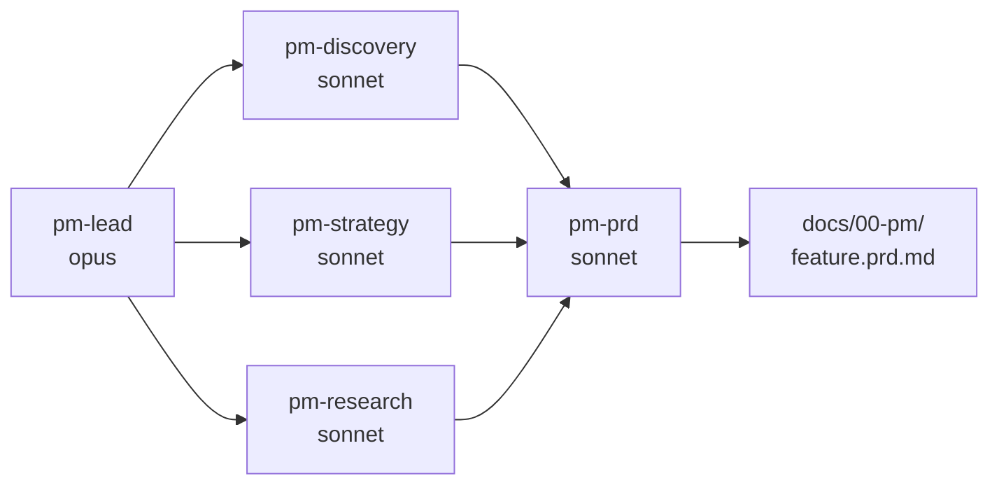

| Agent | 43 Frameworks |
|---|---|
| pm-discovery | Opportunity Solution Tree · Brainstorm · Assumption Risk Assessment |
| pm-strategy | JTBD · Lean Canvas · SWOT · PESTLE · Porter's Five Forces · Growth Loops |
| pm-research | Personas · Competitors · TAM/SAM/SOM · Customer Journey Map · ICP |
| pm-prd | PRD synthesis + Pre-mortem + User/Job Stories + Test Scenarios + Stakeholder Map + Battlecards |

Based on [pm-skills](https://github.com/phuryn/pm-skills) by Pawel Huryn (MIT).

### 7.2 CTO-Led Team — `/pdca team <feature>`

Parallel PDCA execution with multiple specialist agents.

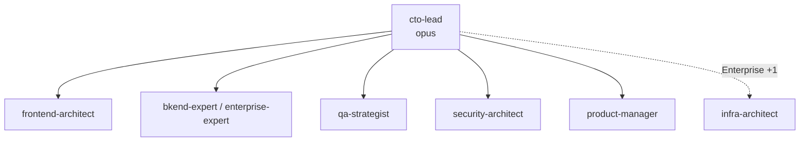

| Level | Teammates | Default agents |
|---|---|---|
| Dynamic | 3 | developer · qa · frontend |
| Enterprise | 5 | architect · developer · qa · reviewer · security |
| Enterprise + Sprint (v2.1.13) | 6 | + sprint-orchestrator |

**Requirements**: `CLAUDE_CODE_EXPERIMENTAL_AGENT_TEAMS=1` + Claude Code v2.1.32+.

### 7.3 QA Lead Team — `/pdca qa <feature>`

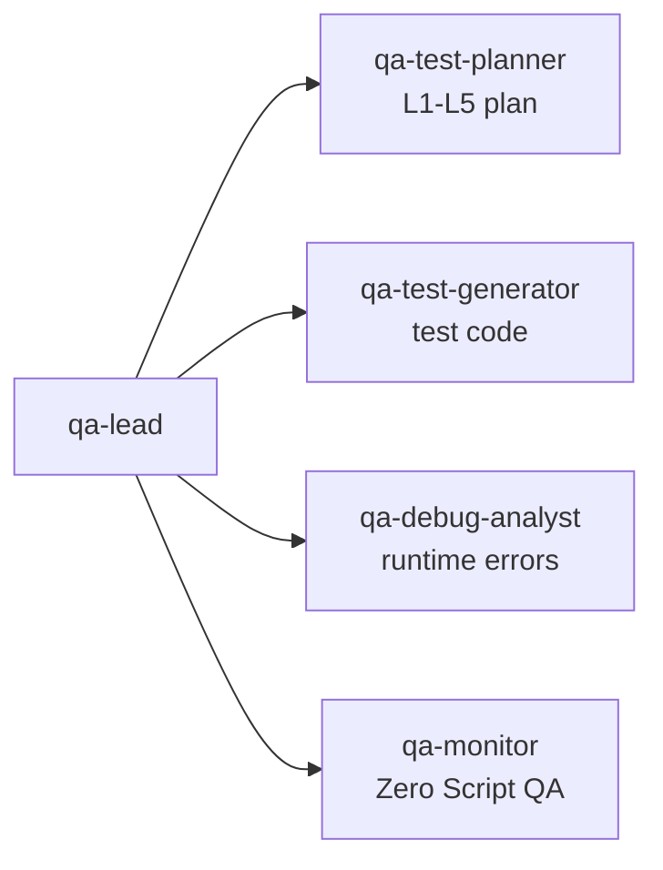

---

## 8. Architecture

### 8.1 Clean Architecture 4-Layer

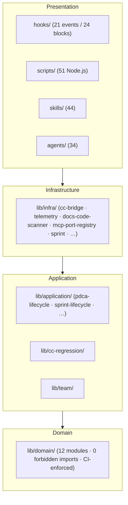

### 8.2 Component Inventory (v2.1.13, measured 2026-05-12)

| Surface | Count | Notes |
|---|---|---|
| Skills | 44 | +sprint added v2.1.13 |
| Agents | 34 | +4 sprint agents added v2.1.13 (sprint-master-planner · sprint-orchestrator · sprint-qa-flow · sprint-report-writer) |
| Hook events / blocks | 21 / 24 | Invariant maintained |
| MCP servers / tools | 2 / 19 | +3 sprint tools (bkit_sprint_list · bkit_sprint_status · bkit_master_plan_read) |
| Lib modules / subdirs | 163 / 19 | +`lib/application/sprint-lifecycle/` (13 modules) + `lib/infra/sprint/` (9 modules) |
| Scripts | 51 | +`sprint-handler.js` (660 LOC) + `sprint-memory-writer.js` (138 LOC) |
| Templates | 39 | +7 sprint templates |
| Test files / cases | 118+ / 4,000+ | +`tests/contract/v2113-sprint-contracts.test.js` (10 SC contracts) |
| ACTION_TYPES | 20 | +sprint_paused · sprint_resumed · master_plan_created · task_created |
| CATEGORIES | 11 | +sprint |
| Port↔Adapter pairs | 7 | cc-payload · state-store · regression-registry · audit-sink · token-meter · docs-code-index · mcp-tool |

### 8.3 Defense-in-Depth 4-Layer

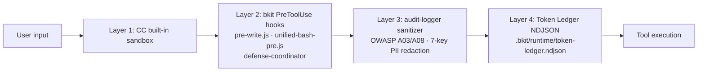

### 8.4 3-Layer Orchestration

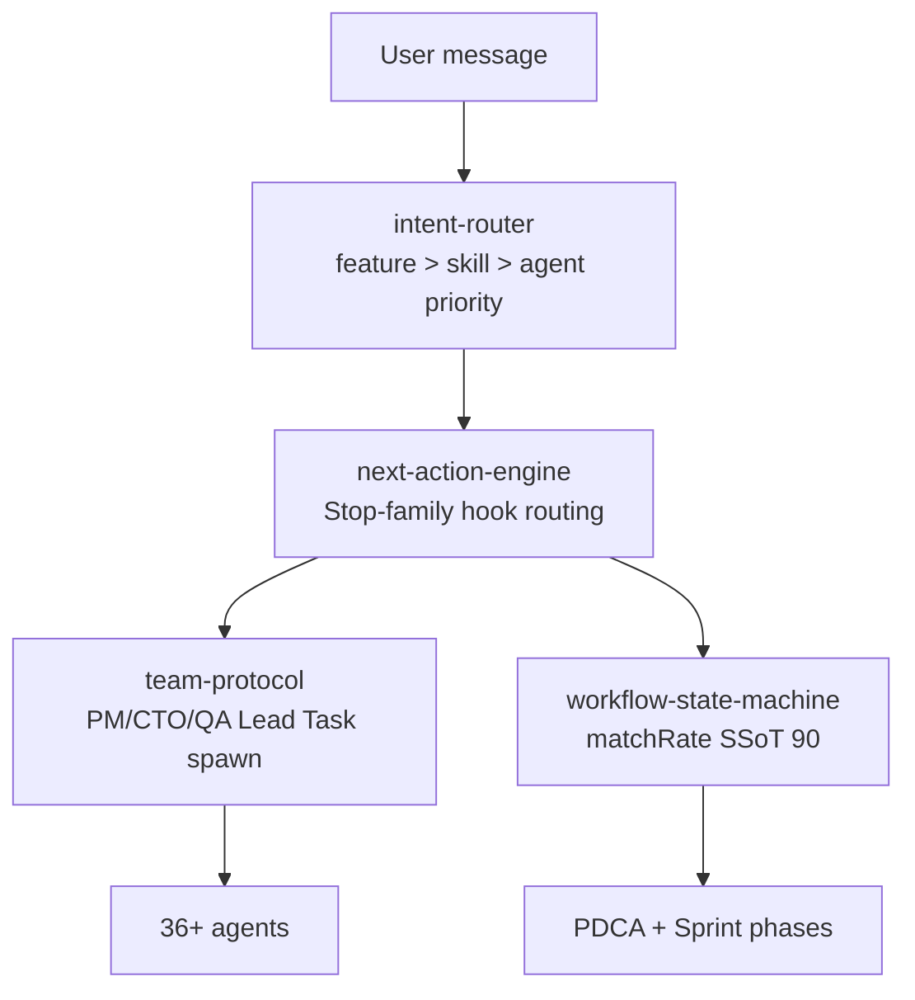

### 8.5 Invocation Contract L1–L5

| Level | What | Count | Where |
|---|---|---|---|
| L1 | Contract baseline JSON | 94 | `tests/contract/baseline.json` |
| L2 | Hook attribution smoke | 98 TC | `tests/integration/hooks/` |
| L3 | MCP stdio runtime | 42 TC | `tests/contract/l3-mcp-stdio.test.js` |
| L3 (v2.1.13) | Sprint cross-sprint contracts | 10 TC (SC-01~10) | `tests/contract/v2113-sprint-contracts.test.js` |
| L5 | E2E shell scenarios | 5 | `tests/e2e/run-all.sh` |

CI gate: `contract-check.yml` enforces 226+ assertions.

---

## 9. Skill Evals

bkit extends Claude Code's Skill Evals into a **complete skill lifecycle management** system: *"are my skills still worth keeping?"*

### 9.1 Three Layers Over Native Evals

| Layer | Claude Code native | bkit enhancement |
|---|---|---|
| Eval execution | Basic runner | `evals/runner.js` with benchmark mode + 29 eval definitions |
| A/B testing | Not available | `evals/ab-tester.js` compares skill performance across models |
| Classification | Not available | All 44 skills classified as Workflow / Capability / Hybrid with deprecation-risk scoring |

### 9.2 Skill Classification

| Class | Count | Purpose | What evals measure |
|---|---|---|---|
| Workflow | 17 | Process automation (PDCA, pipelines) | Regression — these skills are permanent |
| Capability | 18 | Model ability augmentation | **Parity testing** — can the model match this skill's output *without* it? |
| Hybrid | 1 | Both process + capability | Both regression and parity |

When a model upgrade makes a Capability skill redundant, the Model Parity Test detects it:

```bash
# Does the model now produce equivalent results without this skill?
node evals/ab-tester.js --parity phase-3-mockup --model claude-opus-4-7

# Compare skill performance between two models
node evals/ab-tester.js --skill pdca --modelA claude-sonnet-4-6 --modelB claude-opus-4-7

# Run all 29 skill evaluations
node evals/runner.js --benchmark
```

> **Philosophy**: bkit's third principle is *No Guessing*. Skill Evals replace intuition with measurement.

---

## 10. Installation & Customization

### 10.1 Marketplace Install (recommended)

```bash
# Step 1: Add bkit marketplace
/plugin marketplace add popup-studio-ai/bkit-claude-code

# Step 2: Install bkit plugin
/plugin install bkit

# Step 3: (Optional) Enable Agent Teams
export CLAUDE_CODE_EXPERIMENTAL_AGENT_TEAMS=1
```

| Plugin | Best for |
|---|---|
| **bkit** | Full PDCA methodology + Sprint Management for experienced developers |
| **bkit-starter** | Korean learning guide for first-time Claude Code users |

### 10.2 Customization (project-local overrides)

Claude Code searches in this priority order:

1. **Project `.claude/`** (your customizations — highest priority)
2. **User `~/.claude/`**
3. **Plugin installation** (default)

```bash
# Step 1: Find the plugin installation
ls ~/.claude/plugins/bkit/

# Step 2: Copy only the file you want to customize
mkdir -p .claude/skills/starter
cp ~/.claude/plugins/bkit/skills/starter/SKILL.md .claude/skills/starter/

# Step 3: Edit; your version overrides the plugin's
```

Full guide with platform paths + license attribution: [CUSTOMIZATION-GUIDE.md](CUSTOMIZATION-GUIDE.md).

⚠️ **CC v2.1.113+ Users — `~/.claude/skills/` may be silently deleted on first run** ([#51234](https://github.com/anthropics/claude-code/issues/51234)). bkit plugin itself is unaffected (uses `${CLAUDE_PLUGIN_ROOT}/skills/`). Back up user custom skills before upgrading.

---

## 11. Requirements

| Requirement | Minimum | Recommended | Notes |
|---|---|---|---|
| **Claude Code** | v2.1.78 | **v2.1.123+** (conservative) · **v2.1.139** (balanced) | 94 consecutive compatible releases since v2.1.34 |
| **Node.js** | v18+ | — | Hook script execution |
| **Agent Teams (optional)** | `CLAUDE_CODE_EXPERIMENTAL_AGENT_TEAMS=1` | — | Required for `/pdca team` |

> **Troubleshooting**: If you see `"Failed to load hooks"` after install, run `claude update`.

---

## 12. Language Support

bkit auto-detects 8 languages from trigger keywords:

| Language | Trigger sample |
|---|---|
| English | static website, beginner, API design |
| Korean | 정적 웹, 초보자, API 설계 |
| Japanese | 静的サイト, 初心者, API設計 |
| Chinese | 静态网站, 初学者, API设计 |
| Spanish | sitio web estático, principiante |
| French | site web statique, débutant |
| German | statische Webseite, Anfänger |
| Italian | sito web statico, principiante |

Set your reply language with `language` in `.claude/settings.json`:

```json
{ "language": "korean" }
```

Trigger keywords work in any language regardless of reply setting.

---

## 13. License & Contributing

| | |
|---|---|
| **License** | Apache 2.0 · [LICENSE](LICENSE) · [NOTICE](NOTICE) (required for redistribution) |
| **Copyright** | 2024–2026 POPUP STUDIO PTE. LTD. |
| **Contributing** | [CONTRIBUTING.md](CONTRIBUTING.md) — `main` requires admin merge + PR review |
| **Issues** | [GitHub Issues](https://github.com/popup-studio-ai/bkit-claude-code/issues) |
| **Email** | `contact@popupstudio.ai` |

### Release History

bkit follows [Semantic Versioning](https://semver.org/). **All release notes — including the v2.1.13 GA, prior hotfixes, and the complete history back to v1.0.0 — live in [CHANGELOG.md](CHANGELOG.md).** This file is intentionally kept free of version-history accumulation.

---

Made with AI by [POPUP STUDIO](https://popupstudio.ai)
