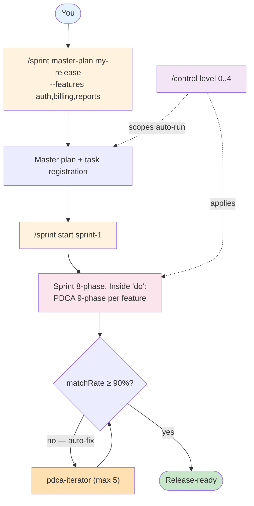
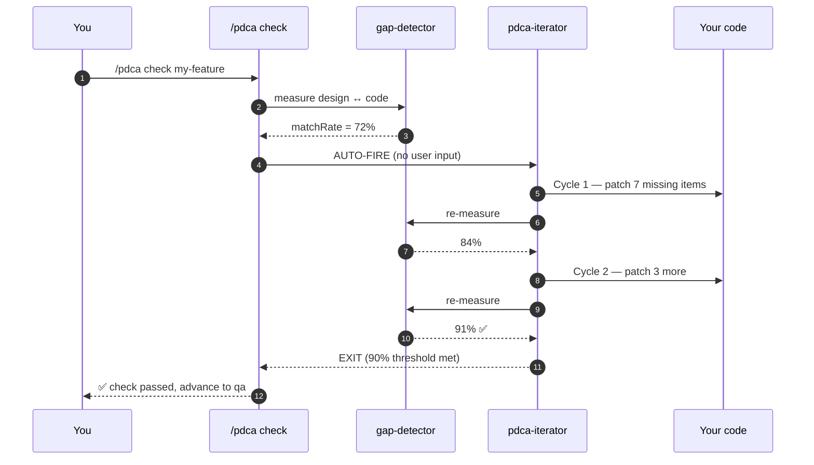
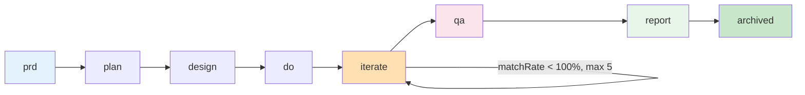
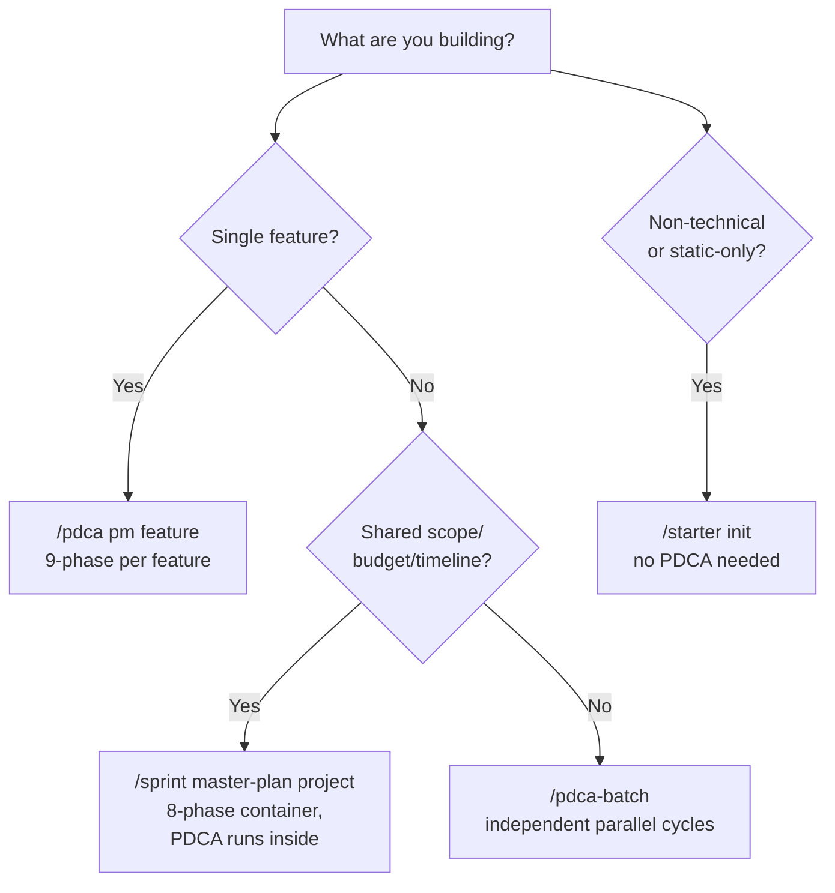
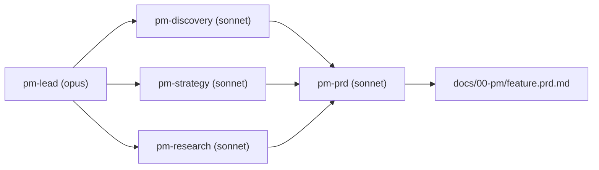
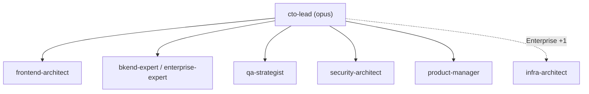
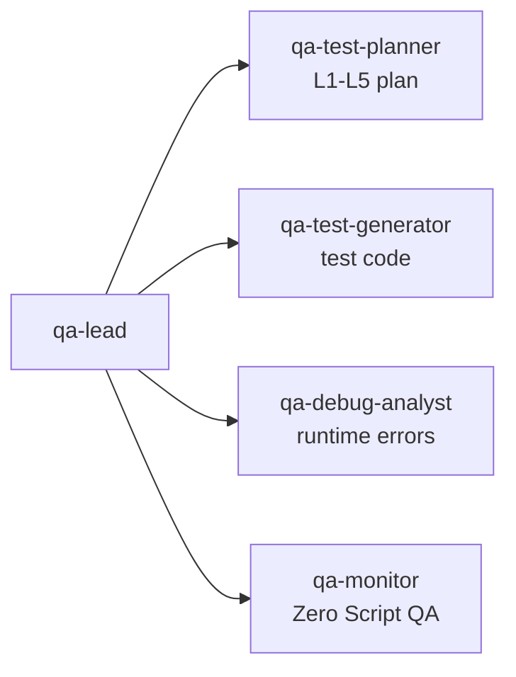
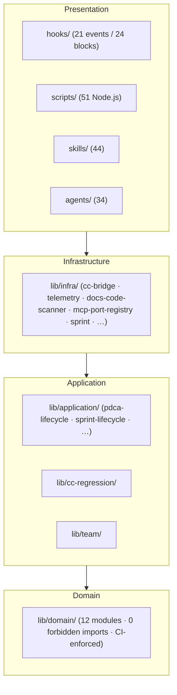
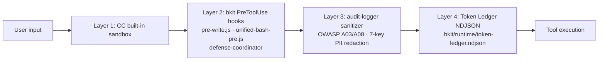
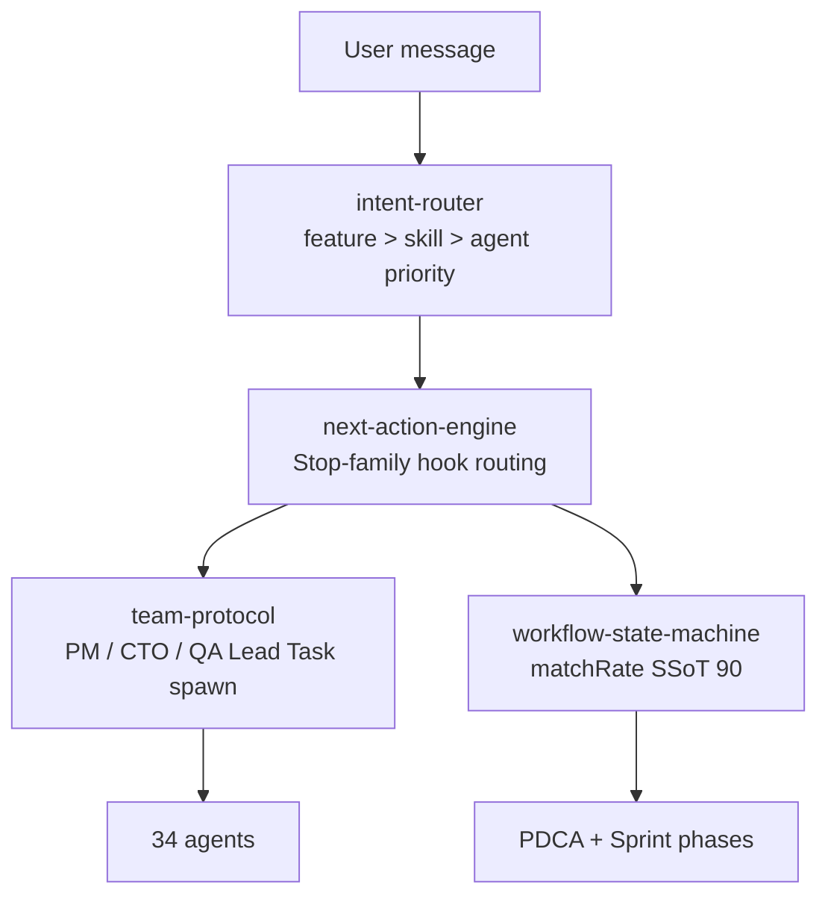

# bkit — Full Reference

> The only Claude Code plugin that verifies AI-generated code against its own design specs.

> **Quick start lives in [README.md](README.md).** This file is the deep reference for the three commands (`/sprint`, `/pdca`, `/control`), the quality-gate catalog, the agent teams, and the architecture. **Release history is in [CHANGELOG.md](CHANGELOG.md) and is not duplicated here.**

[](https://opensource.org/licenses/Apache-2.0)
[](https://code.claude.com)
[](CHANGELOG.md)
[](https://popupstudio.ai)

---

## Table of Contents

1. [Design Philosophy](#1-design-philosophy)
2. [The Three Commands](#2-the-three-commands)
3. [Command Cheat Sheet](#3-command-cheat-sheet)
4. [Workflow Internals](#4-workflow-internals)
5. [Quality Gates & Self-Repair](#5-quality-gates--self-repair)
6. [Trust Level & Control](#6-trust-level--control)
7. [Sprint Management Deep-Dive](#7-sprint-management-deep-dive)
8. [Agent Teams](#8-agent-teams)
9. [Architecture](#9-architecture)
10. [Skill Evals](#10-skill-evals)
11. [Installation & Customization](#11-installation--customization)
12. [Requirements](#12-requirements)
13. [Language Support](#13-language-support)
14. [License & Contributing](#14-license--contributing)

---

## 1. Design Philosophy

bkit is not a productivity hack. It brings **engineering discipline** to AI-native development.

The software industry refined how *humans* write code over decades — version control, code review, CI/CD, testing pyramids. When AI enters the loop, most of that discipline evaporates: developers prompt, accept, ship. Documentation becomes an afterthought. Quality becomes luck.

**bkit exists because AI-assisted development deserves the same rigor as traditional engineering.**

| We optimize for | Over | Concretely |
|---|---|---|
| **Process** | Output | One feature through proper planning + design + implementation + verification beats ten hacked-together features. The PDCA cycle *is* the product. |
| **Verification** | Trust | AI generates plausible code. Plausible is not correct. Every implementation goes through gap analysis. Below 90 % match, the system iterates. We do not ship hope. |
| **Context** | Prompts | A clever prompt helps once. A systematic context system helps every time. 44 skills + 34 agents + 163 lib modules exist so the AI receives the right context at the right moment. |
| **Constraints** | Features | Three project levels, not infinite configuration. Fixed 9-phase PDCA and 8-phase Sprint, not a customizable workflow builder. Opinionated defaults eliminate decision fatigue. |

> *"We do not offer a hundred features. We engineer each one through proper design and verification. That is the difference between a tool and a discipline."*

---

## 2. The Three Commands

Everything else in bkit exists to make these three commands work.

| Command | One-line purpose |
|---|---|
| **`/sprint`** | Group multiple features into a release container, plan them, and run them. |
| **`/pdca`** | Drive a single feature from PRD to release-ready report through 9 phases. |
| **`/control`** | One dial setting how much of `/sprint` and `/pdca` runs unattended. |



### The sprint user journey, step by step

| Step | What you type | What bkit does | Output |
|---|---|---|---|
| **1. Plan** | `/sprint master-plan my-release --name "Q2 Launch" --features auth,billing,reports` | `sprint-master-planner` writes a Context-Anchor-driven master plan. The Context Sizer (Kahn topological + greedy bin-packing) splits features into ≤ 75 K-token sprints honoring dependencies. | `docs/01-plan/features/my-release.master-plan.md` + per-sprint `prd` / `plan` / `design` templates; `.bkit/state/master-plans/my-release.json`; audit entry `master_plan_created` |
| **2. Register** | (automatic in Step 1) | Each sprint in `plan.sprints[]` becomes a task via `TaskCreate`. Cross-sprint `dependsOn` becomes task `blockedBy`. | One task per sprint, Kahn-ordered. Visible via `/sprint list` or `TaskList` |
| **3. Execute** | `/sprint start my-release-s1` | `sprint-orchestrator` advances the 8-phase sprint. Inside `do`, **PDCA 9-phase runs once per feature** — `pm-lead` PRD, `cto-lead` team spawn, `gap-detector` measure, `pdca-iterator` repair, `qa-lead` test, `report-generator` summarize. | Per-feature artifacts under `docs/00-pm/...`, `docs/01-plan/features/...`, `docs/02-design/features/...`, `docs/04-report/features/...`; sprint state `.bkit/state/sprints/my-release-s1.json` |
| **4. Govern** | `/control level 0..4` (anytime) | The dial scopes how far both Sprint and PDCA phases auto-advance before stopping. Trust Score (0–100) can also recommend a level from your track record. | `.bkit/state/trust-profile.json`; effective scope mirrored into `lib/control/automation-controller.js:SPRINT_AUTORUN_SCOPE` (L3 contract test SC-07 enforces the 1:1 mirror) |

**Single feature shortcut**: skip steps 1–2 and run `/pdca pm <feature>` directly. Step 4 still applies.

---

## 3. Command Cheat Sheet

### Sprint (16 sub-actions)

| Sub-action | Purpose |
|---|---|
| `init <id>` | Create a sprint manually (without a master plan) |
| `master-plan <project> --features ...` | Auto-write the master plan + register every sprint as a task |
| `start <id>` | Run the sprint up to the Trust Level scope |
| `status <id>` | Current state + triggers + matrix snapshot |
| `list` | All sprints with phase + status |
| `watch <id>` | Live dashboard, ticks every 30 s |
| `phase <id> --to <phase>` | Manual phase transition |
| `iterate <id>` | matchRate-100 % loop (max 5) |
| `qa <id>` | 7-Layer S1 dataFlow integrity check |
| `report <id>` | Cumulative KPI + lessons learned |
| `archive <id>` | Move to terminal state (forward-only) |
| `pause <id>` / `resume <id>` | Stop / restart auto-run |
| `fork <id> --new <newId>` | Carry incomplete features into a new sprint |
| `feature <id> --action list/add/remove --feature <name>` | Manage features inside the sprint |
| `help` | Help text |

### PDCA (single feature, 9 phases + utilities)

| Sub-action | Purpose | Spawned agents |
|---|---|---|
| `pm <feat>` | 4 PM agents in parallel → PRD with 43 frameworks | pm-lead · pm-discovery · pm-strategy · pm-research · pm-prd |
| `plan <feat>` | Plan with Context Anchor + Module Map | product-manager |
| `design <feat>` | 3 architecture options (Minimal / Clean / Pragmatic) | cto-lead · frontend-architect · security-architect |
| `do <feat>` | Implementation (single-agent mode) | bkend-expert · frontend-architect |
| `team <feat>` | **4–6 specialists in parallel** (recommended for do) | cto-lead orchestrates developer · qa · frontend · security · architect |
| `check <feat>` | Design ↔ code gap analysis | gap-detector |
| `iterate <feat>` | Auto-fix sub-90 % match | pdca-iterator |
| `qa <feat>` | L1–L5 test execution | qa-lead · qa-test-planner · qa-test-generator · qa-debug-analyst · qa-monitor |
| `report <feat>` | KPI + lessons learned | report-generator |
| `archive <feat>` | Move docs to archive + state cleanup | — |
| `status` | Current PDCA state across features | — |
| `cleanup` | Remove stale features (idle > 7 d) | — |
| `watch` | Live dashboard | — |

### Control & utilities

| Command | Purpose |
|---|---|
| `/control level 0..4` | Set autonomy (applies to `/sprint` + `/pdca`) |
| `/control status` | Current Trust Level + Trust Score |
| `/bkit` | List skills, agents, commands |
| `/bkit-explore` | Browse component tree (5 categories) |
| `/pdca-batch` | Independent parallel PDCA cycles (no shared scope) |

---

## 4. Workflow Internals

### 4.1 What each PDCA phase does (without you)

| Phase | bkit auto-action |
|---|---|
| `pm` | `pm-lead` spawns 4 PM agents in parallel: **discovery** (Opportunity Solution Tree + Brainstorm + Assumption Risk) · **strategy** (JTBD + Lean Canvas + SWOT + PESTLE + Porter's + Growth Loops) · **research** (Personas + Competitors + TAM/SAM/SOM + Journey Map + ICP) · **prd** (Pre-mortem + User/Job Stories + Test Scenarios + Stakeholder Map + Battlecards). Output: `docs/00-pm/<feature>.prd.md`. |
| `plan` | `product-manager` writes plan with **Context Anchor** (WHY/WHO/WHAT/RISK/SUCCESS/SCOPE) + Module Map + Session Guide. Output: `docs/01-plan/features/<feature>.plan.md`. |
| `design` | `cto-lead` proposes **3 architecture options** (Minimal / Clean / Pragmatic). Single AskUserQuestion pause for the choice. Output: `docs/02-design/features/<feature>.design.md`. |
| `do` | Single-agent mode (developer / bkend-expert / frontend-architect) **or** team mode via `/pdca team`. |
| `do` *(team mode)* | `cto-lead` spawns 4–6 specialists in parallel: developer · qa · frontend · backend · security · architect (Enterprise). Sequential dispatch enforced under ENH-292 to dodge caching regressions. |
| `check` | `gap-detector` measures design ↔ code match rate. |
| `act` | matchRate ≥ 90 % → advance. < 90 % → `pdca-iterator` Evaluator-Optimizer (max 5 cycles). |
| `qa` | `qa-lead` orchestrates 4 QA agents: test-planner (L1–L5 plan) · test-generator (test code) · debug-analyst (runtime errors) · qa-monitor (Zero Script QA via Docker logs). |
| `report` | `report-generator` produces completion report with KPI + lessons learned + carry items. Output: `docs/04-report/features/<feature>.report.md`. |
| `archive` | Checkpoint preserved, state cleaned, `MEMORY.md` appended. |

### 4.2 Live scenario — Trust L4, autoIterate=true

A realistic 60-minute run with one user input:

```text
10:00  /pdca pm user-auth
       └─ pm-lead spawns 4 PM agents in parallel (43 frameworks)
10:08  PRD complete · auto-advance
10:12  /pdca plan (auto)  → product-manager → Context Anchor written
10:18  /pdca design (auto) → cto-lead → 3 architecture options
       Checkpoint AskUserQuestion: "Minimal / Clean / Pragmatic?"   [1 USER INPUT]
10:20  Design confirmed · auto-advance
10:20  /pdca team (auto) → cto-lead spawns 4 specialists
10:45  Implementation complete · auto-advance to check
10:45  /pdca check (auto) → gap-detector → matchRate = 78 %
       M1 FAIL (78 < 90) → AUTO-TRIGGER /pdca iterate
10:48  Cycle 1: pdca-iterator patches 7 gaps → re-measure 89 %
10:50  Cycle 2: patches 3 more → re-measure 94 % ✅ EXIT
10:50  /pdca qa (auto) → qa-lead → 4 QA agents L1–L5
10:58  QA PASS · auto-advance
10:58  /pdca report (auto) → report-generator → completion report
11:00  Feature complete.
       Total: 60 min · 1 user input · 4–6 parallel agents · 2 self-repair cycles
```

---

## 5. Quality Gates & Self-Repair

Every phase transition is gated. Failure pauses the run and writes an audit entry.

| Gate | Threshold | Triggered when | On failure |
|---|---|---|---|
| **M1** matchRate | ≥ 90 % | check phase ends | `pdca-iterator` auto-fires (Evaluator-Optimizer, max 5 cycles) |
| **M2** codeQualityScore | ≥ 80 | post-do | `code-analyzer` re-runs, user confirmation requested |
| **M3** criticalIssue count | 0 | post-do | Immediate pause, user escalation |
| **M4** conventionCompliance | ≥ 90 % | post-do | Lint auto-fix attempted |
| **M5** testCoverage | ≥ 70 % | post-qa | `qa-test-generator` adds tests |
| **M6** securityScore | ≥ 85 | post-do | `security-architect` review |
| **M7** documentationCompleteness | ≥ 90 % | post-report | Auto-doc generation |
| **M8** sprint matchRate | ≥ 85 % | sprint iterate phase | Sprint iterate loops (max 5) |
| **M9** contractInvariant | 0 violation | CI gate | Build blocked |
| **M10** regressionGuard | 0 new regression | post-iterate | `regression-registry` registers + monitors |
| **S1** dataFlowIntegrity | ≥ 85 % | sprint qa phase | 7-Layer hop re-verified (UI → Client → API → Validation → DB → Response → Client → UI) |

Thresholds live in `bkit.config.json`. Sprint-specific overrides via `sprint.config.{...}` at sprint init.

### The self-repair loop



`/pdca iterate` is **not a button you press**. `gap-detector` detects sub-90 → `pdca-iterator` fires automatically. If the 5th cycle still fails, `ITERATION_EXHAUSTED` auto-pauses the sprint and escalates to you.

---

## 6. Trust Level & Control

`/control level N` is the single autonomy dial. It scopes how far `/sprint` and `/pdca` run before stopping — one knob, both surfaces.

| Level | Name | stopAfter | Pick when |
|---|---|---|---|
| **L0** | Manual | every phase | First-time user; inspect each output |
| **L1** | Guided | plan | Verify scope before AI implements |
| **L2** | Semi-Auto | do | **Default** — Plan/Design/Do auto, QA/Report manual |
| **L3** | Auto | qa | Trust implementation, double-check QA |
| **L4** | Full-Auto | archived | Fire-and-forget; pauses only on quality-gate failure or auto-pause trigger |

### Trust Score (0–100)

bkit computes a Trust Score from your recent track record (matchRate history, manual-override frequency, gate-pass rate). High scores can auto-escalate the level; low scores auto-downgrade. Override anytime with `/control level N`.

| Trust Score | Effect |
|---|---|
| ≥ 80 | `pdca-fast-track` available — auto-approves Checkpoints 1–8 |
| 60–79 | Defaults to L2 (Semi-Auto) |
| < 60 | Defaults to L1 (Guided) |

`autoEscalation` and `autoDowngrade` flags in `bkit.config.json:automation` decide whether bkit may change the level on its own.

---

## 7. Sprint Management Deep-Dive

### 7.1 The 8-phase sprint lifecycle



| Phase | Output | Agent |
|---|---|---|
| prd | `docs/00-pm/<sprint>.prd.md` | sprint-master-planner |
| plan | `docs/01-plan/features/<sprint>.plan.md` | sprint-master-planner |
| design | `docs/02-design/features/<sprint>.design.md` | sprint-master-planner |
| do | Per-feature PDCA cycles run inside | sprint-orchestrator |
| iterate | `docs/03-analysis/<sprint>.iterate.md` (per cycle) | pdca-iterator (delegated) |
| qa | `docs/05-qa/<sprint>.qa.md` (7-Layer S1) | sprint-qa-flow |
| report | `docs/04-report/features/<sprint>.report.md` | sprint-report-writer |
| archived | Terminal state; sprint state preserved | — |

### 7.2 The 4 auto-pause triggers

A sprint pauses automatically on any of these. Resume with `/sprint resume <id>` after fixing the root cause.

| Trigger | Condition | Most common cause |
|---|---|---|
| `QUALITY_GATE_FAIL` | Any M-gate or S1 fails | matchRate stuck below 90 % after iterate exhausts |
| `ITERATION_EXHAUSTED` | iterate phase exceeds 5 cycles | Gap too large to auto-fix; needs human intervention |
| `BUDGET_EXCEEDED` | Token usage > sprint budget (default 1 M) | Feature scope underestimated |
| `PHASE_TIMEOUT` | Phase exceeds timeout (default 4 h) | Hung or blocked |

### 7.3 Sprint vs PDCA vs pdca-batch — pick one



Deep-dive guide: [`docs/06-guide/sprint-management.guide.md`](docs/06-guide/sprint-management.guide.md). PDCA ↔ Sprint migration mapping: [`docs/06-guide/sprint-migration.guide.md`](docs/06-guide/sprint-migration.guide.md).

---

## 8. Agent Teams

bkit ships 34 agents organised into specialist teams. Three teams matter most for the daily workflow:

### 8.1 PM Agent Team — `/pdca pm <feature>`

Runs **before** the Plan phase to produce a comprehensive PRD via automated product discovery. Based on [pm-skills](https://github.com/phuryn/pm-skills) by Pawel Huryn (MIT).



### 8.2 CTO-Led Team — `/pdca team <feature>`

Parallel implementation with multiple specialists.



| Level | Teammates | Default roster |
|---|---|---|
| Dynamic | 3 | developer · qa · frontend |
| Enterprise | 5 | architect · developer · qa · reviewer · security |
| Enterprise + Sprint (v2.1.13) | 6 | + sprint-orchestrator |

**Requirements**: `CLAUDE_CODE_EXPERIMENTAL_AGENT_TEAMS=1` + Claude Code v2.1.32+.

### 8.3 QA Lead Team — `/pdca qa <feature>`



### 8.4 Sprint Team — added in v2.1.13

| Agent | Role |
|---|---|
| `sprint-master-planner` | Writes Context-Anchor-driven master plan; invokes Context Sizer |
| `sprint-orchestrator` | Advances sprint 8 phases; spawns PDCA per feature in `do` |
| `sprint-qa-flow` | Runs 7-Layer S1 dataFlow integrity check |
| `sprint-report-writer` | Aggregates phase + iterate history + KPI + lessons learned |

---

## 9. Architecture

### 9.1 Clean Architecture 4-Layer



### 9.2 Component inventory (v2.1.13, measured 2026-05-12)

| Surface | Count | Notes |
|---|---|---|
| Skills | 44 | +`sprint` added v2.1.13 |
| Agents | 34 | +4 sprint agents added v2.1.13 (sprint-master-planner · sprint-orchestrator · sprint-qa-flow · sprint-report-writer) |
| Hook events / blocks | 21 / 24 | Invariant maintained |
| MCP servers / tools | 2 / 19 | +3 sprint tools (bkit_sprint_list · bkit_sprint_status · bkit_master_plan_read) |
| Lib modules / subdirs | 163 / 19 | +`lib/application/sprint-lifecycle/` (13 modules) + `lib/infra/sprint/` (9 modules) |
| Scripts | 51 | +`sprint-handler.js` (660 LOC) + `sprint-memory-writer.js` (138 LOC) |
| Templates | 39 | +7 sprint templates |
| Test files / cases | 118+ / 4,000+ | +`tests/contract/v2113-sprint-contracts.test.js` (10 SC contracts) |
| ACTION_TYPES | 20 | +sprint_paused · sprint_resumed · master_plan_created · task_created |
| CATEGORIES | 11 | +sprint |
| Port↔Adapter pairs | 7 | cc-payload · state-store · regression-registry · audit-sink · token-meter · docs-code-index · mcp-tool |

### 9.3 Defense-in-Depth 4-Layer



### 9.4 3-Layer Orchestration



### 9.5 Invocation Contract L1–L5

| Level | What | Count | Where |
|---|---|---|---|
| L1 | Contract baseline JSON | 94 | `tests/contract/baseline.json` |
| L2 | Hook attribution smoke | 98 TC | `tests/integration/hooks/` |
| L3 | MCP stdio runtime | 42 TC | `tests/contract/l3-mcp-stdio.test.js` |
| L3 (v2.1.13) | Sprint cross-sprint contracts | 10 TC (SC-01~10) | `tests/contract/v2113-sprint-contracts.test.js` |
| L5 | E2E shell scenarios | 5 | `tests/e2e/run-all.sh` |

CI gate `contract-check.yml` enforces 226+ assertions.

---

## 10. Skill Evals

bkit extends Claude Code's Skill Evals into a **complete skill lifecycle management** system: *"are my skills still worth keeping?"*

### 10.1 Three layers over native evals

| Layer | Claude Code native | bkit enhancement |
|---|---|---|
| Eval execution | Basic runner | `evals/runner.js` with benchmark mode + 29 eval definitions |
| A/B testing | Not available | `evals/ab-tester.js` compares skill performance across models |
| Classification | Not available | All 44 skills classified Workflow / Capability / Hybrid with deprecation-risk scoring |

### 10.2 Skill classification

| Class | Count | Purpose | What evals measure |
|---|---|---|---|
| Workflow | 17 | Process automation (PDCA, pipelines) | Regression — these skills are permanent |
| Capability | 18 | Model ability augmentation | **Parity testing** — can the model match the skill's output without it? |
| Hybrid | 1 | Both process + capability | Both regression and parity |

When a model upgrade makes a Capability skill redundant, the Model Parity Test detects it:

```bash
# Does the model produce equivalent results without this skill?
node evals/ab-tester.js --parity phase-3-mockup --model claude-opus-4-7

# Compare skill performance between two models
node evals/ab-tester.js --skill pdca --modelA claude-sonnet-4-6 --modelB claude-opus-4-7

# Run all 29 skill evaluations
node evals/runner.js --benchmark
```

> **Philosophy**: bkit's third principle is *No Guessing*. Skill Evals replace intuition with measurement.

---

## 11. Installation & Customization

### 11.1 Marketplace install (recommended)

```bash
# Step 1: Add bkit marketplace
/plugin marketplace add popup-studio-ai/bkit-claude-code

# Step 2: Install bkit plugin
/plugin install bkit

# Step 3: (Optional) Enable Agent Teams
export CLAUDE_CODE_EXPERIMENTAL_AGENT_TEAMS=1
```

| Plugin | Best for |
|---|---|
| **bkit** | Full PDCA methodology + Sprint Management for experienced developers |
| **bkit-starter** | Korean learning guide for first-time Claude Code users |

### 11.2 Customization (project-local overrides)

Claude Code searches in this priority order:

1. **Project `.claude/`** (your customizations — highest priority)
2. **User `~/.claude/`**
3. **Plugin installation** (default)

```bash
# Step 1: Find the plugin installation
ls ~/.claude/plugins/bkit/

# Step 2: Copy only the file you want to customize
mkdir -p .claude/skills/starter
cp ~/.claude/plugins/bkit/skills/starter/SKILL.md .claude/skills/starter/

# Step 3: Edit; your version overrides the plugin's
```

Full guide with platform paths + license attribution: [CUSTOMIZATION-GUIDE.md](CUSTOMIZATION-GUIDE.md).

⚠️ **CC v2.1.113+ Users — `~/.claude/skills/` may be silently deleted on first run** ([#51234](https://github.com/anthropics/claude-code/issues/51234)). bkit plugin itself is unaffected (uses `${CLAUDE_PLUGIN_ROOT}/skills/`). Back up user custom skills before upgrading.

---

## 12. Requirements

| Requirement | Minimum | Recommended | Notes |
|---|---|---|---|
| **Claude Code** | v2.1.78 | **v2.1.123+** (conservative) · **v2.1.139** (balanced) | 94 consecutive compatible releases since v2.1.34 |
| **Node.js** | v18+ | — | Hook script execution |
| **Agent Teams (optional)** | `CLAUDE_CODE_EXPERIMENTAL_AGENT_TEAMS=1` | — | Required for `/pdca team` |

> **Troubleshooting**: If you see `"Failed to load hooks"` after install, run `claude update`.

---

## 13. Language Support

bkit auto-detects 8 languages from trigger keywords:

| Language | Trigger sample |
|---|---|
| English | static website, beginner, API design |
| Korean | 정적 웹, 초보자, API 설계 |
| Japanese | 静的サイト, 初心者, API設計 |
| Chinese | 静态网站, 初学者, API设计 |
| Spanish | sitio web estático, principiante |
| French | site web statique, débutant |
| German | statische Webseite, Anfänger |
| Italian | sito web statico, principiante |

Set your reply language with `language` in `.claude/settings.json`:

```json
{ "language": "korean" }
```

Trigger keywords work in any language regardless of the reply setting.

---

## 14. License & Contributing

| | |
|---|---|
| **License** | Apache 2.0 · [LICENSE](LICENSE) · [NOTICE](NOTICE) (required for redistribution) |
| **Copyright** | 2024–2026 POPUP STUDIO PTE. LTD. |
| **Contributing** | [CONTRIBUTING.md](CONTRIBUTING.md) — `main` requires admin merge + PR review |
| **Issues** | [GitHub Issues](https://github.com/popup-studio-ai/bkit-claude-code/issues) |
| **Email** | `contact@popupstudio.ai` |

### Release history

bkit follows [Semantic Versioning](https://semver.org/). **All release notes live in [CHANGELOG.md](CHANGELOG.md)** and are not duplicated here.

---

Made with AI by [POPUP STUDIO](https://popupstudio.ai)
