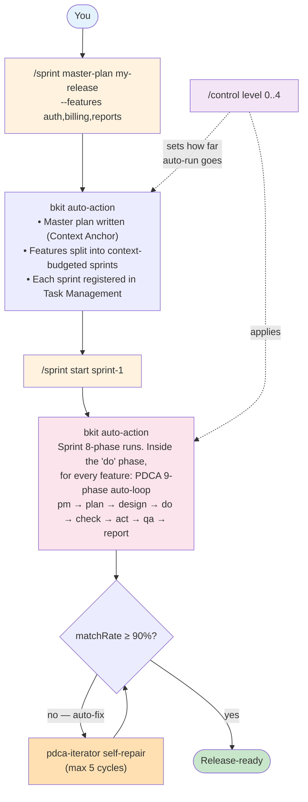

# bkit — AI Native Development OS

> The only Claude Code plugin that verifies AI-generated code against its own design specs.

**Three commands run your entire release. One dial controls how much is unattended.**

- **`/sprint`** — group features, plan, run them
- **`/pdca`** — drive a single feature through plan → design → implement → verify → repair
- **`/control`** — set autonomy L0 (manual) → L4 (fire-and-forget)

[](https://opensource.org/licenses/Apache-2.0)
[](https://code.claude.com)
[](CHANGELOG.md)
[](https://popupstudio.ai)

---

## The problem

AI writes plausible code fast. Plausible isn't correct. You only notice the spec drift at PR review — far too late, far too expensive to fix.

bkit closes the loop: **every implementation is gap-checked against its own design**, sub-90% match triggers automatic repair, and a quality gate refuses to advance until thresholds pass.

## How it works



That's the whole picture. `/sprint master-plan` writes a plan and registers every sprint as a task. `/sprint start` runs one — and inside it, bkit PDCA cycles through each feature. `/control` decides how much you supervise.

Single feature? Skip the sprint layer and run `/pdca pm <feature>` directly.

## The three commands

| Command | When to use | What bkit does without you |
|---|---|---|
| **`/sprint master-plan <project> --features a,b,c`** | Multi-feature release (quarter, milestone) | `sprint-master-planner` writes the master plan with Context Anchor. The Context Sizer (Kahn topological sort + greedy bin-packing) splits features into ≤ 75 K-token sprints. Each sprint is registered in the Task Management System with `blockedBy` dependencies. |
| **`/sprint start <sprint-id>`** | Execute one of the planned sprints | `sprint-orchestrator` advances the sprint through 8 phases (`prd → plan → design → do → iterate → qa → report → archived`). Inside `do`, bkit runs PDCA 9-phase **once per feature**. |
| **`/pdca pm <feature>`** | Standalone single feature | PDCA 9-phase loop: `pm-lead` (43-framework PRD) → `product-manager` (plan) → `cto-lead` (3 architecture options) → `/pdca team` (4–6 specialists in parallel) → `gap-detector` (matchRate) → `pdca-iterator` (auto-repair if < 90 %) → QA → report. |
| **`/control level 0..4`** | Anytime — set autonomy | L0 stops at every phase; L2 (default) runs through `do` and pauses for QA/Report; L4 is fire-and-forget, pausing only on a quality-gate failure or one of the 4 sprint auto-pause triggers. |

## Quick start

```bash
# 1. Install
claude plugin install bkit

# 2. (Optional) Parallel team execution
export CLAUDE_CODE_EXPERIMENTAL_AGENT_TEAMS=1

# 3. Try a single feature first
/pdca pm my-feature

# 4. Or plan a multi-feature release
/sprint master-plan my-release --name "Q2 Launch" --features auth,billing,reports
/sprint start my-release-s1
```

Recommended Claude Code runtime: **v2.1.123+** (conservative) or **v2.1.139** (balanced, 94 consecutive compatible). Minimum **v2.1.78**.

## Trust Level — the one dial

`/control level N` scopes how far the orchestrator runs unattended. **It applies to both `/sprint` and `/pdca` simultaneously** — no second knob to remember.

| Level | Stops after | Pick when |
|---|---|---|
| **L0** Manual | every phase | First time using bkit; want to inspect each output |
| **L1** Guided | plan | Verifying scope before AI implements |
| **L2** Semi-Auto (default) | do | Plan/Design/Do auto; you approve QA + Report |
| **L3** Auto | qa | Trust the implementation, double-check QA |
| **L4** Full-Auto | archived | Fire-and-forget; pauses only on quality-gate failure or auto-pause trigger |

bkit also computes a **Trust Score (0–100)** from your track record and can auto-recommend a level. Override anytime with `/control level N`.

## Choose your workflow

| Working on… | Use |
|---|---|
| **One feature** | `/pdca pm <feature>` (single-feature PDCA loop) |
| **Multiple features sharing a release, scope, or budget** | `/sprint master-plan <project>` → `/sprint start <id>` |
| **Multiple unrelated features in parallel** | `/pdca-batch` (independent cycles, no shared scope) |
| **Static or non-technical site** | `/starter init` (no PDCA needed) |

## Quality gates

Every phase transition is gated. The most important ones:

| Gate | Threshold | What happens on failure |
|---|---|---|
| **M1** matchRate (design ↔ code) | ≥ 90 % | `pdca-iterator` auto-repairs (max 5 cycles); after 5, the sprint pauses with `ITERATION_EXHAUSTED` |
| **M3** critical issues | 0 | Phase pauses immediately, audit log captures it, you decide |
| **S1** dataFlow integrity (sprint QA) | ≥ 85 % | 7-Layer hop re-verified: UI → Client → API → Validation → DB → Response → Client → UI |

Full M1–M10 + S1 catalog and the 4 sprint auto-pause triggers: [README-FULL.md](README-FULL.md).

## Architecture at a glance

44 skills · 34 agents · 21 hook events / 24 blocks · 2 MCP servers (19 tools) · 163 lib modules across 19 subdirs · 51 scripts · 39 templates · 118+ test files / 4,000+ cases. Clean Architecture 4-Layer · Defense-in-Depth 4-Layer · Invocation Contract L1–L5 (226 CI-gated assertions).

Full architecture deep-dive: [README-FULL.md](README-FULL.md).

## Documentation

| Path | Contents |
|---|---|
| [README-FULL.md](README-FULL.md) | Full command reference, deep architecture, Skill Evals |
| [CHANGELOG.md](CHANGELOG.md) | Release history (single source of truth) |
| [CUSTOMIZATION-GUIDE.md](CUSTOMIZATION-GUIDE.md) | Override bkit components in your `.claude/` |
| [AI-NATIVE-DEVELOPMENT.md](AI-NATIVE-DEVELOPMENT.md) | AI-Native principles |
| [`docs/06-guide/sprint-management.guide.md`](docs/06-guide/sprint-management.guide.md) | Sprint Management deep-dive |
| [`docs/06-guide/sprint-migration.guide.md`](docs/06-guide/sprint-migration.guide.md) | PDCA ↔ Sprint migration mapping |
| [`bkit-system/`](bkit-system/) | Component graph (Obsidian-friendly) |

## License

Apache 2.0 — see [LICENSE](LICENSE). POPUP STUDIO PTE. LTD. · `kay@popupstudio.ai`
