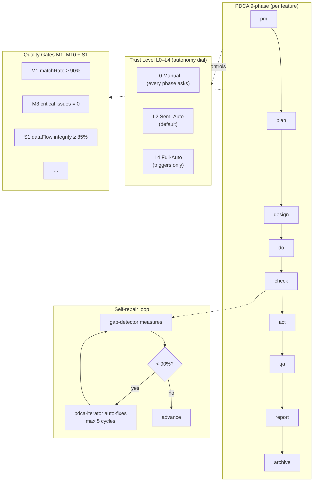
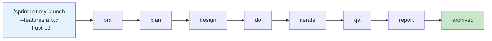

# bkit — AI Native Development OS

> The only Claude Code plugin that verifies AI-generated code against its own design specs.

**Six `/pdca` commands drive your feature from PRD to release-ready report.** Quality gates catch what AI misses; sub-90% match auto-fires `pdca-iterator` to repair the gap.

[](https://opensource.org/licenses/Apache-2.0)
[](https://code.claude.com)
[](CHANGELOG.md)
[](https://popupstudio.ai)

---

## The problem with "just prompt and ship"

AI produces plausible code fast. Plausible isn't correct. You only notice the spec drift at PR review — far too late, and far too expensive to fix.

bkit closes that loop: **every implementation is gap-checked against its own design**, sub-90% match triggers automatic iteration, and a 7-stage quality gate refuses to advance until thresholds pass.

## 30-second demo

```mermaid
flowchart LR
    A[/pdca pm/] --> B[/pdca plan/]
    B --> C[/pdca design/]
    C --> D[/pdca team]
    D --> E[/pdca check]
    E -- "matchRate ≥ 90%" --> F[/pdca qa/]
    E -- "< 90% — auto" --> G[/pdca iterate/<br/>max 5 cycles]
    G --> E
    F --> H[/pdca report/]
    H --> I[/pdca archive/]
    style A fill:#e3f2fd
    style D fill:#fff3e0
    style E fill:#fce4ec
    style G fill:#ffe0b2
    style F fill:#e8f5e9
```

One feature, one autonomous run. You answer at most one architecture question. bkit does the rest.

## What you actually get

| Outcome | How bkit delivers it |
|---|---|
| **Autonomous workflow** | `/pdca team` spawns 4–6 specialist agents in parallel (cto-lead orchestrates frontend / backend / QA / security). `/sprint start --trust L4` drives all 8 phases unattended. |
| **Self-verification + self-repair** | `gap-detector` measures design ↔ code match rate. Below 90% auto-fires `pdca-iterator` (Evaluator-Optimizer, max 5 cycles). The AI that wrote the code does **not** judge the code — a different agent does. |
| **Trust Level dial L0–L4** | `/control level N` toggles how much runs unattended. L2 default keeps human-in-the-loop on QA/Report. L4 stops only on quality-gate failure. |
| **Quality Gates M1–M10 + S1** | Every phase transition is gated (matchRate, criticalIssue count, convention compliance, dataFlow integrity, …). Fail = phase pauses, audit log captures the reason. |

## Quick start

```bash
# 1. Install through the Claude Code marketplace
claude plugin install bkit

# 2. (Optional) Enable parallel team execution
export CLAUDE_CODE_EXPERIMENTAL_AGENT_TEAMS=1

# 3. Drive your first feature end-to-end
/pdca pm my-feature        # 4 PM agents → PRD with 43 frameworks
/pdca team my-feature      # cto-lead spawns specialists; check + iterate run automatically
/pdca qa my-feature        # L1–L5 testing
/pdca report my-feature    # Completion report with KPIs
```

First-time users see a 3-minute interactive tutorial on session start. Recommended Claude Code runtime: **v2.1.123+** (conservative, 79 consecutive compatible at recommendation point) or **v2.1.139** (balanced, 94 consecutive compatible). Minimum **v2.1.78**.

## The autonomous workflow

bkit's value is the *integration* of four axes — not any single one alone.



| Axis | What you control | What bkit does |
|---|---|---|
| **PDCA 9-phase** | `/pdca <phase> <feature>` | Each phase spawns the right agent: pm-lead, product-manager, cto-lead, gap-detector, qa-monitor, report-generator |
| **Trust Level** | `/control level 0..4` | Scopes how many phases auto-advance without confirmation |
| **Quality Gates** | Thresholds in `bkit.config.json` | Halt the run if matchRate / criticalIssues / coverage / dataFlow fall below threshold |
| **Auto-Iterate** | `pdca.autoIterate = true` | Fires `pdca-iterator` on sub-90% match; runs up to 5 cycles before escalating |

## Sprint Management — when one feature isn't enough

For multi-feature releases (Q2 launch, v1.x.y milestone) bkit groups features into a **Sprint** meta-container with its own 8-phase lifecycle and 4 auto-pause triggers.



| Pick this | When |
|---|---|
| **`/pdca <feature>`** | Single feature, isolated work |
| **`/sprint init <id> --features ...`** | 2+ features sharing scope, budget, or timeline |
| **`/pdca-batch`** | Multiple unrelated features running in parallel (no shared scope) |

**4 Auto-Pause Triggers** (sprint stops automatically):
`QUALITY_GATE_FAIL` · `ITERATION_EXHAUSTED` · `BUDGET_EXCEEDED` · `PHASE_TIMEOUT`

Full reference: [`skills/sprint/SKILL.md`](skills/sprint/SKILL.md) · Korean deep-dive: [`docs/06-guide/sprint-management.guide.md`](docs/06-guide/sprint-management.guide.md) · Real example: [`docs/01-plan/features/v2113-docs-sync.master-plan.md`](docs/01-plan/features/v2113-docs-sync.master-plan.md) (this release's own documentation sync sprint).

## Architecture at a glance

| Surface | Count |
|---|---|
| Skills · Agents | 44 · 34 |
| Hook events · blocks | 21 · 24 |
| MCP servers · tools | 2 · 19 |
| Lib modules · subdirs · scripts | 163 · 19 · 51 |
| Templates · Tests | 39 · 118+ files / 4,000+ cases |

Clean Architecture 4-Layer with 7 Port↔Adapter pairs · Defense-in-Depth 4-Layer (CC sandbox → bkit PreToolUse → audit sanitizer → Token Ledger) · Invocation Contract L1–L5 (226 CI-gated assertions). Full inventory in [README-FULL.md](README-FULL.md).

## Documentation

| Path | What's there |
|---|---|
| [README-FULL.md](README-FULL.md) | Deep architecture, full command reference, Skill Evals framework |
| [CHANGELOG.md](CHANGELOG.md) | Release history (single source of truth — *not* duplicated here) |
| [CUSTOMIZATION-GUIDE.md](CUSTOMIZATION-GUIDE.md) | Override bkit components in your `.claude/` directory |
| [AI-NATIVE-DEVELOPMENT.md](AI-NATIVE-DEVELOPMENT.md) | AI-Native principles and bkit's implementation |
| [`docs/06-guide/`](docs/06-guide/) | Korean deep-dive guides for Sprint Management + migration |
| [`bkit-system/`](bkit-system/) | Obsidian-graph documentation of skills, agents, philosophy |

## License

Apache 2.0 — see [LICENSE](LICENSE). POPUP STUDIO PTE. LTD. · `kay@popupstudio.ai`
